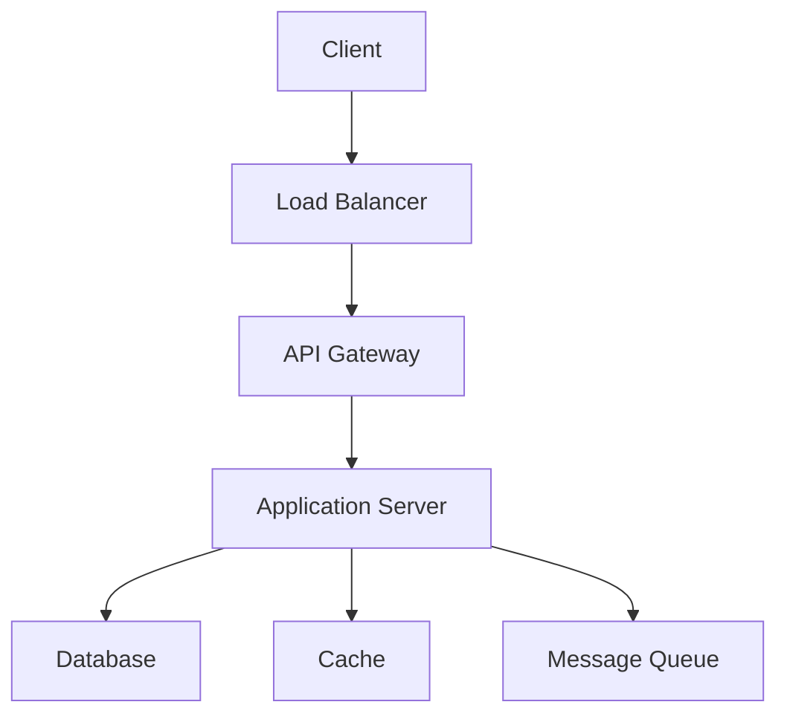

# {SYSTEM_NAME} Architecture

> **Template Instructions**: Replace `{SYSTEM_NAME}` with the actual system/component name. Fill in each section with architecture-specific information.

## Overview

High-level description of the system architecture, its purpose, and key design decisions.

## System Context

### External Dependencies
- **Service 1**: How it's used and why
- **Service 2**: How it's used and why  
- **Database**: Type and usage patterns
- **Message Queues**: If applicable

### Key Stakeholders
- **End Users**: Who uses this system
- **Administrators**: Who manages it
- **Developers**: Who maintains it

## Architecture Diagram



*Note: Replace with actual architecture diagram or ASCII art*

## Core Components

### Component 1: {Component Name}
- **Purpose**: What this component does
- **Responsibilities**: Key responsibilities
- **Technology**: Language/framework used
- **Scaling**: How it scales
- **Dependencies**: What it depends on

### Component 2: {Component Name}  
- **Purpose**: What this component does
- **Responsibilities**: Key responsibilities
- **Technology**: Language/framework used
- **Scaling**: How it scales
- **Dependencies**: What it depends on

### Component 3: {Component Name}
- **Purpose**: What this component does
- **Responsibilities**: Key responsibilities  
- **Technology**: Language/framework used
- **Scaling**: How it scales
- **Dependencies**: What it depends on

## Data Architecture

### Data Flow

```
Input → Validation → Processing → Storage → Response
```

Detailed explanation of how data moves through the system:

1. **Data Ingestion**: How data enters the system
2. **Data Processing**: How data is transformed
3. **Data Storage**: Where and how data is stored
4. **Data Retrieval**: How data is accessed and returned

### Database Design

#### Primary Database
- **Type**: PostgreSQL/MySQL/MongoDB/etc.
- **Purpose**: Primary data storage
- **Schema**: Key tables/collections
- **Indexing Strategy**: Important indexes
- **Backup Strategy**: How backups are handled

#### Cache Layer
- **Type**: Redis/Memcached/etc.
- **Purpose**: Performance optimization
- **Cache Strategy**: What's cached and for how long
- **Cache Invalidation**: How cache is kept fresh

### Data Models

#### Core Entities

```javascript
// User Entity
{
  id: "uuid",
  email: "string",
  profile: {
    name: "string",
    created_at: "timestamp"
  },
  permissions: ["array"]
}
```

```javascript
// Other Important Entity
{
  id: "uuid",
  property1: "type",
  property2: "type",
  relationships: {
    user_id: "uuid",
    related_items: ["array"]
  }
}
```

## API Architecture

### API Design Principles
- RESTful design patterns
- Consistent error handling
- Proper HTTP status codes
- API versioning strategy

### Endpoint Structure

```
GET    /api/v1/resources        # List resources
GET    /api/v1/resources/:id    # Get specific resource  
POST   /api/v1/resources        # Create resource
PUT    /api/v1/resources/:id    # Update resource
DELETE /api/v1/resources/:id    # Delete resource
```

### Authentication & Authorization
- **Authentication Method**: JWT/OAuth2/API Keys
- **Authorization Model**: RBAC/ABAC/Simple permissions
- **Session Management**: How sessions are handled

## Security Architecture

### Security Layers
1. **Network Security**: Firewalls, VPNs, load balancers
2. **Application Security**: Input validation, OWASP compliance
3. **Data Security**: Encryption at rest and in transit
4. **Identity & Access**: Authentication and authorization

### Key Security Controls
- **Input Validation**: How inputs are sanitized
- **SQL Injection Prevention**: Parameterized queries, ORMs
- **XSS Prevention**: Output encoding, CSP headers
- **CSRF Protection**: Tokens and same-origin policies

### Secrets Management
- **Environment Variables**: For configuration
- **Secret Management Service**: For sensitive data
- **Certificate Management**: SSL/TLS certificates

## Deployment Architecture

### Environments
- **Development**: Local development setup
- **Staging**: Pre-production testing
- **Production**: Live environment

### Infrastructure
- **Hosting Platform**: AWS/GCP/Azure/On-premises
- **Container Strategy**: Docker/Kubernetes if applicable
- **Load Balancing**: How traffic is distributed
- **Auto-scaling**: How system scales with demand

### Deployment Pipeline

```
Code Commit → Build → Test → Deploy to Staging → Deploy to Production
```

- **CI/CD Tools**: GitHub Actions/Jenkins/etc.
- **Testing Gates**: What tests must pass
- **Deployment Strategy**: Blue-green/Rolling/Canary
- **Rollback Strategy**: How to revert deployments

## Performance Architecture

### Performance Targets
- **Response Time**: 95th percentile targets
- **Throughput**: Requests per second
- **Availability**: Uptime targets
- **Scalability**: Growth projections

### Performance Optimizations
- **Caching Strategy**: What's cached where
- **Database Optimization**: Indexing, query optimization
- **CDN Usage**: Static asset delivery
- **Background Processing**: Async job handling

## Monitoring & Observability

### Metrics & Monitoring
- **Application Metrics**: Performance indicators
- **Infrastructure Metrics**: Server health, resource usage
- **Business Metrics**: User engagement, conversion rates

### Logging Strategy
- **Log Levels**: DEBUG, INFO, WARN, ERROR
- **Structured Logging**: JSON formatted logs
- **Log Aggregation**: Centralized log collection
- **Log Retention**: How long logs are kept

### Alerting
- **Critical Alerts**: System down, high error rates
- **Warning Alerts**: Performance degradation
- **Information Alerts**: Deployment notifications

## Disaster Recovery

### Backup Strategy
- **Data Backups**: Frequency and retention
- **Configuration Backups**: Infrastructure as code
- **Testing**: Backup restoration testing

### Failover Procedures
- **Automatic Failover**: What happens automatically  
- **Manual Procedures**: Steps for manual intervention
- **Recovery Time Objectives**: Target recovery times

## Quality Attributes

### Scalability
- **Horizontal Scaling**: Adding more servers
- **Vertical Scaling**: Adding more power
- **Database Scaling**: Sharding/replication strategies

### Reliability
- **Error Handling**: How errors are managed
- **Circuit Breakers**: Preventing cascade failures
- **Retry Mechanisms**: Handling transient failures

### Maintainability
- **Code Organization**: How code is structured
- **Documentation**: What's documented where
- **Testing Strategy**: Unit/integration/e2e tests

## Design Decisions & Trade-offs

### Decision 1: {Technology/Pattern Choice}
- **Decision**: What was chosen
- **Alternatives Considered**: Other options evaluated
- **Reasoning**: Why this choice was made
- **Trade-offs**: What was gained/lost

### Decision 2: {Architecture Pattern}
- **Decision**: What was chosen
- **Alternatives Considered**: Other options evaluated  
- **Reasoning**: Why this choice was made
- **Trade-offs**: What was gained/lost

## Future Considerations

### Known Limitations
- Current bottlenecks or constraints
- Technical debt areas
- Scalability concerns

### Planned Improvements  
- Architecture evolution plans
- Technology upgrades
- Performance enhancements

## Related Documentation

- [API Reference](../04-development/api-reference.md)
- [Deployment Guide](../04-development/deployment.md)
- [Monitoring Guide](../04-development/monitoring.md)

---

**Navigation**: [← Back to Getting Oriented](../01-getting-oriented/README.md) | [Core Concepts →](../02-core-concepts/README.md)