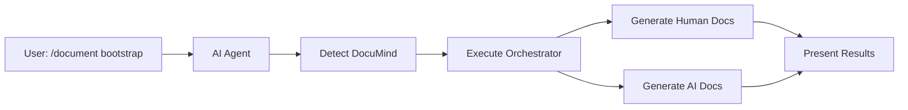

# DocuMind 🧠

[](https://github.com/denniswebb/documind/actions/workflows/test.yml)
[](https://www.npmjs.com/package/@dennis-webb/documind)
[](./coverage/coverage-summary.html)
[](https://nodejs.org/)
[](https://opensource.org/licenses/MIT)

**IDE-Native Documentation System with Automatic Dual-Purpose Generation**

DocuMind transforms how you document your projects by enabling documentation commands directly in your IDE through AI assistants. When you run `/document` commands, DocuMind automatically generates BOTH human-readable and AI-optimized documentation in one operation, providing comprehensive coverage without additional complexity.

## ✨ Features

- **🎯 Slash Commands**: Use `/document bootstrap`, `/document expand [concept]`, etc.
- **🤖 Dual-Purpose Generation**: Automatically creates both human and AI documentation
- **🗣️ Natural Language**: "Document the authentication system" → comprehensive documentation
- **🔌 IDE Native**: Works with GitHub Copilot, Claude, Cursor, Gemini CLI
- **📦 Zero Install**: Clone repo → commands work instantly for everyone
- **🔄 Version Controlled**: All configuration tracked in git
- **🎨 Template System**: Consistent, professional documentation structure
- **🔗 Smart Linking**: Automatic cross-references and navigation
- **⚡ AI Orchestration**: Seamless coordination between human and AI documentation

## 🚀 Quick Start

### Installation

```bash
# Clone and run
git clone https://github.com/denniswebb/documind.git
cd your-project
node /path/to/documind/.documind/scripts/install.js
```

### First Use

After installation, try any of these with your AI assistant:

```
/document bootstrap
/document expand authentication  
/document analyze stripe-integration
"Document the API endpoints"
"Create a getting started guide"
"Update the deployment documentation"
```

## 📋 Commands

| Command | Description | Output |
|---------|-------------|--------|
| `/document bootstrap` | Generate complete documentation | Human docs in `/docs/` + AI docs in `/docs/ai/` |
| `/document expand [concept]` | Document specific concepts | Dual-purpose concept documentation |
| `/document update [section]` | Refresh existing docs | Updated human + AI versions |
| `/document analyze [integration]` | Document external services | Integration guides (both formats) |
| `/document index` | Rebuild navigation | Updated navigation + AI index |
| `/document search [query]` | Find documentation | Search both human and AI docs |

### Natural Language Support

DocuMind recognizes these patterns automatically:

- "Document this component" → `/document expand [component]`
- "Update the setup guide" → `/document update setup-guide`  
- "How do we use MongoDB?" → `/document analyze mongodb`
- "Create API documentation" → `/document expand api`

## 🎯 Supported AI Tools

DocuMind works with all major AI coding assistants, automatically orchestrating dual-purpose documentation generation:

### GitHub Copilot
- Reads `.github/copilot-instructions.md`
- Automatically executes AI orchestrator for comprehensive generation
- Presents both human and AI documentation results

### Claude (Anthropic)
- Uses `CLAUDE.md` instructions for automatic dual-purpose generation
- Natural language command recognition with orchestrator execution
- Seamless presentation of comprehensive documentation results

### Cursor IDE
- Integrates via `.cursor/rules/documind.mdc` with automatic orchestration
- Also supports `.cursorrules` format
- Smart detection and dual-purpose generation

### Gemini CLI
- Configured through `GEMINI.md` for comprehensive documentation
- Command pattern recognition with automatic AI orchestration
- Structured presentation of both documentation types

## 📁 Project Structure

After installation, DocuMind creates:

```
your-project/
├── .documind/                          # Core system (immutable)
│   ├── VERSION                         # Version tracking
│   ├── commands.md                     # Command definitions  
│   ├── system.md                       # System instructions
│   ├── templates/                      # Documentation templates
│   └── scripts/                        # Install/update scripts
│
├── .github/copilot-instructions.md     # GitHub Copilot config
├── CLAUDE.md                           # Claude instructions
├── .cursor/rules/documind.mdc          # Cursor rules
├── .cursorrules                        # Legacy Cursor support
├── GEMINI.md                           # Gemini CLI instructions
│
└── docs/                               # Generated documentation
    ├── README.md                       # Master index
    ├── 01-getting-oriented/            # Project overview
    ├── 02-core-concepts/               # Key concepts
    ├── 03-integrations/                # External services
    ├── 04-development/                 # Developer guides
    └── ai/                             # AI-optimized documentation
        ├── AI_README.md                # AI master index
        └── *-ai.md                     # AI-optimized files
```

## 🎨 Documentation Templates

DocuMind includes professional templates for:

- **Concepts**: Core abstractions and patterns
- **Integrations**: External service documentation  
- **Architecture**: System design and structure
- **Getting Started**: Setup and onboarding guides
- **API Reference**: Complete API documentation

## 🔄 Workflow Example

1. **Install DocuMind** in your project
2. **Commit the configuration** files to git
3. **Team members clone** - commands work immediately
4. **Use natural language** or slash commands
5. **Documentation is generated** in `/docs`
6. **Navigation updates** automatically

```bash
# Developer A installs
npx @documind/core init
git add . && git commit -m "Add DocuMind documentation system"

# Developer B clones and immediately has access
git clone repo && cd repo
# In IDE with AI: "Document the authentication system"
# → Full auth documentation generated automatically
```

## 🧠 How It Works

1. **AI assistants read** the instruction files (CLAUDE.md, .cursorrules, etc.)
2. **Commands are recognized** through natural language or slash syntax
3. **DocuMind detection** automatically checks for installation and capabilities
4. **AI orchestrator executes** to coordinate dual-purpose generation
5. **Templates provide structure** for both human and AI documentation
6. **Both documentation types** are generated simultaneously
7. **Navigation updates** automatically for both human and AI indexes
8. **Results presented** comprehensively showing both documentation types

### Automatic Dual-Purpose Generation

When you run `/document bootstrap`, DocuMind automatically:
- 📚 Generates human-readable documentation in `/docs/`
- 🤖 Creates AI-optimized documentation in `/docs/ai/`
- 🔗 Updates navigation and cross-references for both
- 📊 Tracks token counts and generation metrics
- ✅ Presents comprehensive results to the user

This happens transparently - users don't need to understand the dual-purpose nature.

## 🤖 AI Integration Features

### Automatic Detection and Orchestration

DocuMind includes sophisticated AI integration capabilities:



### Key Components

- **AI Orchestrator** (`ai-orchestrator.js`): Coordinates dual-purpose generation
- **Detection Utility** (`detect-documind.js`): Checks installation and capabilities
- **Enhanced AI Configs**: Updated instructions for all major AI tools
- **Workflow Automation**: Seamless execution without user intervention

### Example AI Interaction

When you ask Claude: "Document the authentication system"

1. 🔍 **Detection**: Claude checks for DocuMind installation
2. ⚡ **Execution**: Runs `ai-orchestrator.js expand authentication`
3. 📚 **Generation**: Creates both human and AI documentation
4. 📊 **Results**:
   ```
   ✅ Authentication documentation generated!

   📚 Human Documentation:
   - /docs/02-core-concepts/authentication.md

   🤖 AI Documentation:
   - /docs/ai/authentication-concept-ai.md (2,850 tokens)

   Both versions now available and cross-linked.
   ```

### Supported Workflows

| Workflow | Human Output | AI Output | Use Case |
|----------|-------------|-----------|----------|
| Bootstrap | Complete `/docs/` structure | Full `/docs/ai/` with token metrics | Project initialization |
| Expand | Concept documentation | AI-optimized concept files | Feature documentation |
| Analyze | Integration guides | Service-specific AI docs | External service docs |
| Update | Refreshed human docs | Updated AI versions | Maintenance |
| Search | Human doc matches | AI doc matches with context | Content discovery |

### Fallback Behavior

If DocuMind isn't installed, AI agents automatically:
- Use their native documentation capabilities
- Suggest DocuMind installation for enhanced features
- Maintain full productivity without interruption

## 📦 Installation Options

### GitHub Template
```bash
gh repo create my-app --template documind/template
```

### Manual Installation
```bash
git clone https://github.com/denniswebb/documind.git
cp -r documind/.documind your-project/
cd your-project && node .documind/scripts/install.js
```

## 🔧 Configuration

### Environment Detection
DocuMind automatically detects your AI tools and generates appropriate configuration files:

- Existing `.github/` → GitHub Copilot support
- Existing `.cursor/` → Cursor IDE support  
- Custom detection logic for other tools

### Manual Configuration
You can customize the system by editing:
- Command definitions in `.documind/core/commands.md`
- System behavior in `.documind/core/system.md`  
- Templates in `.documind/templates/`

## 🚀 Advanced Usage

### Programmatic Usage
```javascript
// Example usage for local development
const fs = require('fs');
const path = require('path');

function runScript(scriptName) {
  const scriptPath = `.documind/scripts/${scriptName}.js`;
  if (fs.existsSync(scriptPath)) {
    require(path.resolve(scriptPath));
  } else {
    console.log(`Script ${scriptName} not found`);
  }
}

runScript('install');
runScript('update');
```

### Custom Commands
Add your own documentation patterns by extending the command definitions:

```markdown
### /document custom [target]
Your custom documentation command
- Maps to specific templates
- Follows your conventions
```

## 🔄 Updates

Keep DocuMind current:

```bash
# Update from local development
node .documind/scripts/update.js
```

## 🧪 Testing

DocuMind includes comprehensive testing with Node.js built-in test runner and GitHub Actions CI/CD.

### Running Tests

```bash
# Run all tests
npm test

# Run specific test suites
npm run test:unit          # Unit tests only
npm run test:integration   # Integration tests only
npm run test:performance   # Performance tests only

# Run tests with coverage
npm run test:coverage

# Validate coverage thresholds
npm run coverage:validate

# Generate coverage reports
npm run coverage:report
```

### Test Structure

```
tests/
├── unit/                  # Unit tests for core functionality
│   ├── install.test.js           # Installation script tests
│   ├── generate-commands.test.js # Command generation tests
│   ├── update.test.js             # Update script tests
│   ├── template-processing.test.js # Template system tests
│   └── gitignore-operations.test.js # Git integration tests
│
├── integration/          # Integration and end-to-end tests
│   ├── fresh-install.test.js      # Fresh installation workflow
│   ├── ai-detection.test.js       # AI tool detection tests
│   ├── update-workflow.test.js    # Update process tests
│   ├── error-handling.test.js     # Error scenario tests
│   ├── full-deployment.test.js    # Complete deployment validation
│   └── platform-compatibility.test.js # Cross-platform tests
│
├── performance/          # Performance and speed tests
│   └── install-speed.test.js      # Installation speed benchmarks
│
└── utils/                # Test utilities and helpers
    ├── test-environment.js        # Test environment setup
    ├── mock-repo.js               # Mock repository generator
    └── assertions.js              # Custom test assertions
```

### Coverage Requirements

- **Lines**: ≥90%
- **Functions**: ≥90% 
- **Branches**: ≥80%
- **Statements**: ≥90%

### CI/CD Pipeline

Our GitHub Actions workflow tests across:

- **Node.js versions**: 16.x, 18.x, 20.x, 21.x
- **Operating system**: Ubuntu (latest)
- **Test categories**: Unit, integration, performance
- **Quality checks**: Linting, security audit, coverage validation

### Performance Benchmarks

- **Small projects**: <5 seconds installation
- **Medium projects**: <15 seconds installation  
- **Large projects**: <30 seconds installation
- **Updates**: <5 seconds

### Local Development Testing

```bash
# Run tests in watch mode
npm run test:watch

# Test against multiple Node.js versions
npm run test:matrix

# Performance testing
npm run test:performance

# Coverage validation
npm run coverage:validate
```

## 🎯 Design Principles

1. **IDE Native**: Feels like a natural extension of your development environment
2. **Zero Install**: Works immediately after cloning for all team members
3. **AI Agnostic**: Supports any AI assistant that can read instruction files
4. **Version Controlled**: All configuration is tracked and shareable
5. **Non-Invasive**: Integrates with existing workflows without disruption

## 🤝 Contributing

We welcome contributions! See our [Contributing Guide](./docs/04-development/contributing.md) for:

- How to report bugs
- How to suggest features
- Development setup
- Pull request process

## 📄 License

MIT License - see [LICENSE](./LICENSE) for details.

## 🔗 Links

- **GitHub**: [denniswebb/documind](https://github.com/denniswebb/documind)
- **Documentation**: [Full Docs](./docs/README.md)
- **Issues**: [Bug Reports](https://github.com/denniswebb/documind/issues)

---

*Making documentation as natural as having a conversation with your AI assistant*# Test change to trigger workflow
