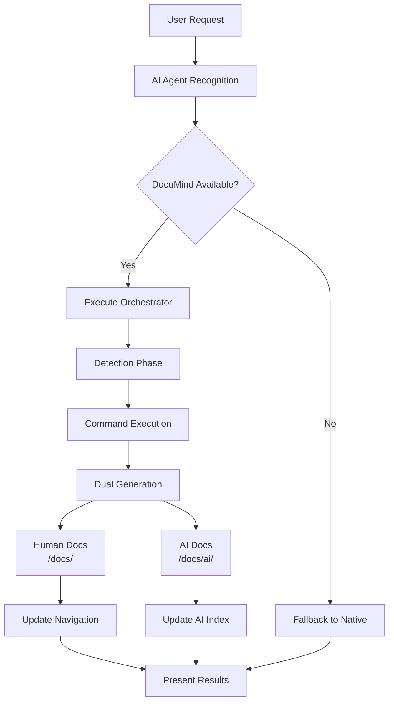

# DocuMind Documentation Workflows

## Overview

This guide explains the automatic dual-purpose documentation generation workflows that AI agents execute when users request documentation. DocuMind generates both human-readable and AI-optimized documentation seamlessly through a single command interface.

## Core Workflow Architecture



## Workflow Types

### 1. Bootstrap Workflow

**Purpose**: Generate complete project documentation structure

**User Triggers**:
- `/document bootstrap`
- "Generate all project documentation"
- "Create complete documentation"

**Execution Flow**:
1. **Detection**: Check DocuMind availability
2. **Orchestration**: Execute `ai-orchestrator.js bootstrap`
3. **Generation**:
   - Process all available manifests
   - Generate human documentation in `/docs/`
   - Generate AI documentation in `/docs/ai/`
   - Create directory structure (01-getting-oriented, 02-core-concepts, etc.)
4. **Indexing**: Update AI_README.md master index
5. **Presentation**: Show comprehensive results

**Expected Output**:
```
✅ Complete documentation suite generated!

📚 Human Documentation (8 files):
- /docs/01-getting-oriented/project-overview.md
- /docs/02-core-concepts/ (4 concept files)
- /docs/03-integrations/ (2 integration files)
- /docs/04-development/contributing.md

🤖 AI Documentation (8 files):
- /docs/ai/ (AI-optimized versions)
- Total tokens: 15,250
- Updated AI_README.md master index

📊 Generation Summary:
- Duration: 2.3 seconds
- Human docs: 8 files
- AI docs: 8 files
- Total tokens: 15,250
```

### 2. Concept Expansion Workflow

**Purpose**: Create detailed documentation for specific concepts

**User Triggers**:
- `/document expand [concept]`
- "Document the authentication system"
- "Create documentation for user management"

**Execution Flow**:
1. **Detection**: Verify DocuMind availability
2. **Orchestration**: Execute `ai-orchestrator.js expand [concept]`
3. **Manifest Selection**: Find relevant concept manifests
4. **Generation**:
   - Generate human concept documentation
   - Generate AI-optimized concept documentation
   - Apply concept-specific variables
5. **Indexing**: Update master index with new concept
6. **Presentation**: Show focused concept results

**Example Execution**:
```bash
# User: "Document the authentication system"
node .documind/scripts/ai-orchestrator.js expand authentication
```

**Expected Output**:
```
✅ Authentication concept documented successfully!

📚 Human Documentation:
- /docs/02-core-concepts/authentication.md
- Complete guide with examples and implementation details

🤖 AI Documentation:
- /docs/ai/authentication-concept-ai.md
- Optimized for AI consumption (2,850 tokens)
- Added to AI master index

🔗 Cross-references updated in navigation
```

### 3. Integration Analysis Workflow

**Purpose**: Document external service integrations

**User Triggers**:
- `/document analyze [service]`
- "How do we use Stripe?"
- "Document the MongoDB integration"

**Execution Flow**:
1. **Detection**: Check system readiness
2. **Orchestration**: Execute `ai-orchestrator.js analyze [service]`
3. **Integration Focus**: Use integration-specific manifests
4. **Generation**:
   - Create service integration documentation
   - Generate API usage examples
   - Document configuration and setup
5. **Categorization**: Place in `/docs/03-integrations/`
6. **Presentation**: Show integration-specific results

### 4. Section Update Workflow

**Purpose**: Refresh existing documentation sections

**User Triggers**:
- `/document update [section]`
- "Update the API documentation"
- "Refresh the getting started guide"

**Execution Flow**:
1. **Detection**: Verify DocuMind status
2. **Orchestration**: Execute `ai-orchestrator.js update [section]`
3. **Section Identification**: Locate existing documentation
4. **Regeneration**:
   - Refresh human documentation
   - Update AI-optimized versions
   - Maintain existing structure
5. **Synchronization**: Update cross-references
6. **Presentation**: Show update summary

### 5. Index Rebuild Workflow

**Purpose**: Regenerate documentation navigation and cross-references

**User Triggers**:
- `/document index`
- "Rebuild documentation index"
- "Update navigation"

**Execution Flow**:
1. **Detection**: Confirm system availability
2. **Orchestration**: Execute `ai-orchestrator.js index`
3. **Scanning**: Analyze existing documentation structure
4. **Index Generation**:
   - Rebuild AI_README.md master index
   - Update navigation files
   - Refresh cross-references
5. **Validation**: Verify link integrity
6. **Presentation**: Show indexing results

### 6. Search Workflow

**Purpose**: Find existing documentation content

**User Triggers**:
- `/document search [query]`
- "Find documentation about databases"
- "Search for API endpoints"

**Execution Flow**:
1. **Detection**: Check search capabilities
2. **Orchestration**: Execute `ai-orchestrator.js search [query]`
3. **Content Scanning**:
   - Search human documentation
   - Search AI documentation
   - Identify relevant matches
4. **Result Compilation**: Aggregate findings
5. **Presentation**: Show search results with context

## Error Recovery Workflows

### 1. DocuMind Not Available

**Scenario**: Detection shows DocuMind is not installed

**Recovery Flow**:
1. **Acknowledge**: Recognize the documentation request
2. **Fallback**: Use AI agent's native documentation capabilities
3. **Suggestion**: Recommend DocuMind installation
4. **Guidance**: Provide installation instructions if requested

**Example Response**:
```
📝 Documentation request acknowledged

⚠️  DocuMind not detected - using native capabilities
💡 For enhanced dual-purpose generation, install DocuMind:
   npx @dennis-webb/documind init

📚 Generated basic documentation using Claude's capabilities
```

### 2. Orchestrator Execution Failure

**Scenario**: AI orchestrator script encounters errors

**Recovery Flow**:
1. **Error Parsing**: Analyze JSON error response
2. **Context Assessment**: Determine error type and cause
3. **Remediation**: Provide specific troubleshooting steps
4. **Fallback**: Continue with alternative approach
5. **User Support**: Offer additional assistance

**Example Error Handling**:
```json
{
  "success": false,
  "error": "DocuMind installation incomplete: .documind/core not found",
  "suggestions": [
    "Run DocuMind update: npx @dennis-webb/documind update",
    "Verify installation: ls -la .documind/"
  ]
}
```

### 3. Partial Generation Failure

**Scenario**: Some documentation generates successfully, others fail

**Recovery Flow**:
1. **Success Tracking**: Identify what was generated successfully
2. **Failure Analysis**: Catalog what failed and why
3. **Partial Results**: Present successful documentation
4. **Issue Resolution**: Provide specific fixes for failures
5. **Retry Option**: Offer to retry failed components

## Workflow Optimization

### Performance Considerations

1. **Caching**: Cache detection results during session
2. **Parallel Execution**: Generate human and AI docs simultaneously
3. **Incremental Updates**: Only regenerate changed content
4. **Resource Management**: Monitor token usage and file sizes

### Quality Assurance

1. **Validation**: Verify generated content meets standards
2. **Cross-Reference**: Ensure links and navigation work correctly
3. **Consistency**: Maintain formatting and structure standards
4. **Completeness**: Verify all requested documentation is generated

### User Experience

1. **Progress Indication**: Show generation progress for long operations
2. **Clear Results**: Present outcomes with visual differentiation
3. **Error Communication**: Provide actionable error messages
4. **Fallback Transparency**: Clearly indicate when fallbacks are used

## Integration Patterns

### Natural Language Processing

AI agents should recognize these patterns and map them to workflows:

| User Input | Detected Intent | Workflow |
|------------|----------------|----------|
| "Document everything" | Complete generation | Bootstrap |
| "Explain authentication" | Concept documentation | Expand |
| "How does Stripe work here?" | Integration analysis | Analyze |
| "Update the API guide" | Section refresh | Update |
| "Fix the navigation" | Index rebuild | Index |
| "Find database docs" | Content search | Search |

### Command Parameter Extraction

Extract parameters from natural language:

- **Concept names**: "authentication", "user management", "data flow"
- **Service names**: "stripe", "mongodb", "redis", "aws"
- **Section names**: "api", "getting-started", "installation"
- **Search queries**: "database schema", "api endpoints", "configuration"

### Result Formatting

Standardize result presentation across all AI agents:

1. **Success indicators**: ✅ for completion, ⚠️ for warnings
2. **Content categorization**: 📚 for human docs, 🤖 for AI docs
3. **Metrics display**: File counts, token counts, duration
4. **Action summaries**: What was created, updated, or found

## Best Practices

### For AI Agent Developers

1. **Always detect first**: Check DocuMind availability before assuming capability
2. **Parse JSON responses**: Handle structured output from orchestrator
3. **Provide fallbacks**: Ensure functionality without DocuMind
4. **Show comprehensive results**: Highlight dual-purpose generation
5. **Handle errors gracefully**: Provide actionable troubleshooting

### For Users

1. **Use natural language**: AI agents recognize documentation intents
2. **Be specific**: Provide concept/service names for targeted documentation
3. **Check results**: Review both human and AI documentation generated
4. **Update regularly**: Keep documentation current with code changes
5. **Leverage search**: Use search workflow to find existing content

## Conclusion

The DocuMind workflows enable AI agents to provide comprehensive documentation generation automatically. By following these patterns, AI agents deliver both human-readable and AI-optimized documentation through simple, natural language commands, making the dual-purpose generation transparent to users while ensuring complete documentation coverage.